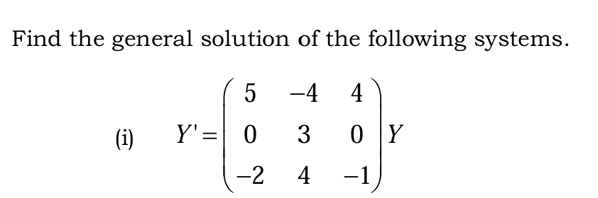

# Differential Equation System Solver using Eigen Decomposition

A robust Python script utilizing **SymPy** to solve continuous-time systems of linear differential equations of the form $Y' = AY$. This repository demonstrates how to mathematically extract exact symbolic representations of eigenvalues, eigenvectors, and the final general solution $Y(t)$.

---

## 📌 Problem Statement

Here is the system of differential equations being solved in this project:



## 🧠 The Mathematical Context

Given the system $Y' = AY$ from the image above, the matrix $A$ is:

$$A = \begin{pmatrix} 5 & -4 & 4 \\ 0 & 3 & 0 \\ -2 & 4 & -1 \end{pmatrix}$$

The characteristic equation yields the **repeated eigenvalues** $\lambda = 3, 3, 1$. Even though $\lambda = 3$ is a repeated root (algebraic multiplicity of 2), the matrix yields two linearly independent eigenvectors for it (geometric multiplicity of 2). Therefore, the matrix is fully diagonalizable, and the general solution takes the standard exact form without needing generalized eigenvectors (no $t \cdot e^{\lambda t}$ terms).

---

## 🚀 Features

* **Symbolic Computation:** Uses `sympy` to keep values exact (no floating-point inaccuracies like `0.99999`).
* **Eigen Decomposition:** Automatically extracts eigenvalues and their corresponding eigenvectors.
* **Automated General Solution:** Assembles the final solution $Y(t) = c_1 v_1 e^{\lambda_1 t} + c_2 v_2 e^{\lambda_2 t} + c_3 v_3 e^{\lambda_3 t}$ automatically.

---

## 📦 Installation & Setup

1. Clone this repository:
   ```bash
   git clone [https://github.com/Kavi-Cs/ode-eigen-solver.git](https://github.com/Kavi-Cs/ode-eigen-solver.git)
   cd ode-eigen-solver
